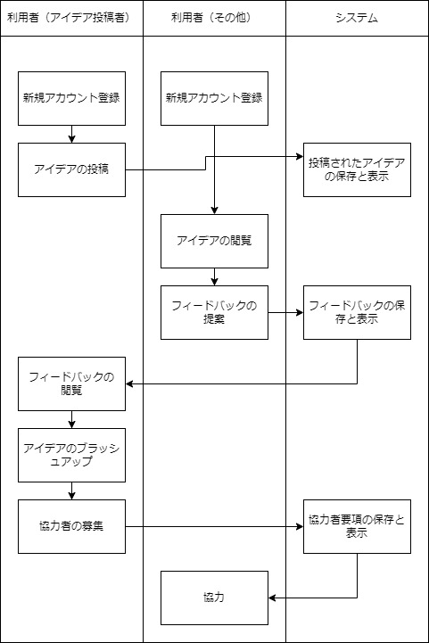
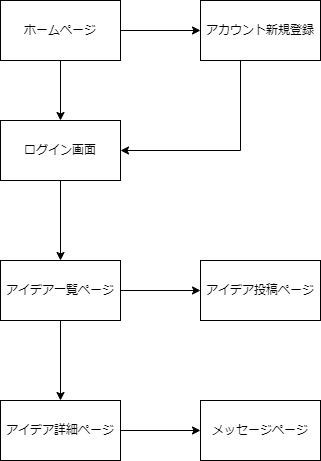

## オリジナルプロダクト案
### 一言サービスコンセプト（サービスのキャッチコピーを一言で）
- アイデアを共有し、ともに実現する
### 誰のどんな課題を解決するのか
- アイデアや企画が実現するために、多くの意見や協力があれば実現までのハードルが低くなります。しかし、そのような環境を作り出すのは一人では難しいことが多いです。この課題を解決し、より多くのアイデアが現実のものとなることで、社会全体の創造性や革新性を向上させたいからです。
### なぜそれを解消したいのか
-  アイデアや企画が実現するまでには、多くの人の意見や協力が必要となる場合があります。しかし、そのような環境を作り出すは難しいことが多いです。そのような課題を解決し、より多くのアイデアが現実のものとなることで、社会全体の創造性や革新性を向上させたいからです。
### どうやって解決するのか
- 利用者は自分のアイデアを投稿することができ、他のユーザーからのフィードバックを受け取ることができます。また、協力者を募ることも可能で、メッセージ機能を通じて直接コミュニケーションをとることができます。
### 機能要件
- アイデア投稿昨日
    - ユーザーは自分のアイデアを投稿することができます。その際に、アイデアの詳細やビジョン、必要なスキルやリソースなどを記載します。
- アイデア検索機能
    - ユーザーはキーワードやカテゴリに基づいてアイデアを検索することができます。
- フィードバック機能
    - ーザーは他のユーザーのアイデアに対してフィードバックを提供することができます。フィードバックは質問形式でも、アドバイス形式でも可能です。
- 協力リクエスト機能
    - ユーザーは特定のアイデアに対して協力を申し込むことができます。アイデア提案者は申し込みを受けて協力者を選ぶことができます。
- メッセージ機能
    - アイデアオーナーと協力者間で直接コミュニケーションをとるためのメッセージ機能を提供します。
- ログイン機能
- 
### 非機能要件
- スケーラビリティ
    - AWSを用いることで、需要に応じてリソースをスケールアップ・ダウンすることが可能
- 運用性
    - GitHub ActionsでCI/CDを設定する。
- セキュリティ機能
    - ユーザーの個人情報とアイデアは適切に保護。パスワードはハッシュ化され、個人情報は暗号化されて保存。また、サービスは常に最新のセキュリティパッチとアップデートを適用するべきです。
- 互換性
    - 複数のブラウザおよびデバイスで動作

<h3>業務フロー</h3>

<h3>画面遷移図</h3>

<h3>ワイヤーフレーム</h3>

<h3>テーブル定義</h3>

車両テーブル（Vehicles）

| カラム名      | データ型       | NULL | キー | 初期値 | AUTO INCREMENT | 説明 |
| ------------- | -----------|--|--|--|--|----------------------------- |
| vehicle_id    | Integer    ||主キー||YES||
| make          | String     ||||| 車両のメーカー名             |
| model         | String     ||||| 車両のモデル名              |
| year          | Integer    ||||| 車両の製造年                |
| license_plate | String     ||||| ナンバープレート番号        |
| lease_expiry  | Date       |YES|||| リースの満了日              |
| inspection_due| Date       |YES|||| 次の車検日 |

ユーザーテーブル（Users）

| カラム名      | データ型       | NULL | キー | 初期値 | AUTO INCREMENT | 説明 |
| ------------- | -----------|--|--|--|--|----------------------------- |
| user_id      | Integer        ||主キー||YES||
| name         | String         ||||| ユーザー名                  |
| email        | String         ||||| メールアドレス              |
| password     | String         ||||| パスワード（ハッシュ化済み） |

通知テーブル（Notifications）

| カラム名      | データ型       | NULL | キー | 初期値 | AUTO INCREMENT | 説明 |
| ------------- | -----------|--|--|--|--|----------------------------- |
| notification_id | Integer        ||主キー||YES||
| user_id         | Integer   ||外部キー|||通知を受け取るユーザーID   |
| vehicle_id      | Integer    ||外部キー|||通知に関連する車両ID       |
| date            | Date       |||||通知を送る日                |

 <h3>システム構成図</h3> 

